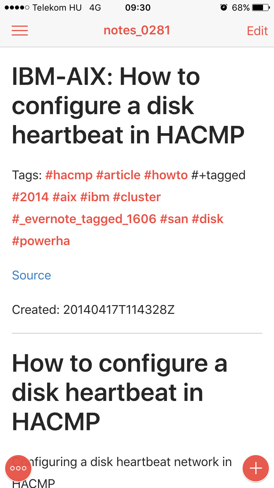
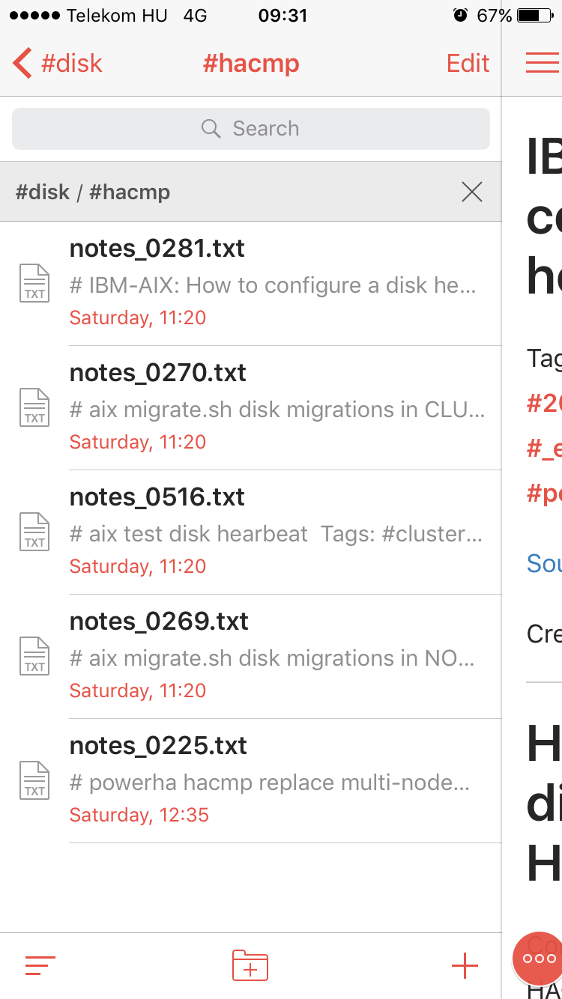
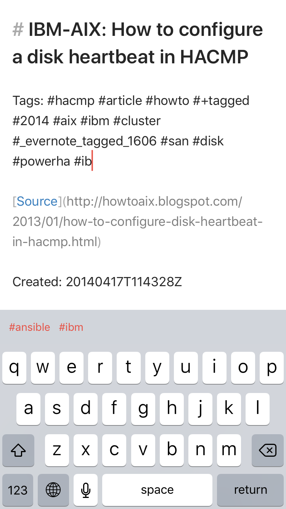

# Introduction

[Evernote](http://www.evernote.com) and [1Writer](http://1writerapp.com) are two note taking apps. Evernote
focuses more on giving the end user rich text and the ability to upload
voice clips and images for OCR. 1Writer on the other hand is basically
a markdown based plain text editor for iOS devices.

This package installs a script to help you migrate from Evernote into
markdown files, keeping some metadata information for convenient use
with 1Writer.  The script will take an Evernote ``enex`` export and turn it into 
a directory of ``md`` files.

The html that is provided by Evernote is processed by the [html2text](http://pypi.python.org/pypi/html2text/)
library. This transforms the html into [Markdown](http://daringfireball.net/projects/markdown/). The 1Writer application web UI
supports previewing notes in Markdown, so this works out nicely.

## Development Installation

Clone this repository with ``git``:

    $ git clone https://github...

Enter the code directory:

    $ cd ever21writer

Install live preserving local changes to the code:

    $ pip install -e .

## Usage

Once it is installed, you will have a new executable available to you.
Before you can run the conversion, you will need to export your notes.
This can be done from the desktop client. You can select the notes you
want to export, then ``Export Notes to Archive...``, and select the ``enex`` format.

Once you have that, you can run the script on the file setting the ``--output``
to a directory and using ``1writer`` as the parameter to ``--format``:

    $ ever2simple my_evernote.enex --output 1writer_dir --format 1writer

That will output each note in a ``*.md`` file named by creation date into the
``1writer_dir`` directory (creating it if it doesn't exist).

All you need is to put this directory into your Dropbox or iCloud accont for
synchornization, and to add this directory in your 1Writer app.

## Metadata saved from Evernote

The following metadata is saved from Evernote to the header of the output
``*.md`` files: 

 - tags as a list of hashtags
 - source URL of the note if any
 - creation date of the note

This is how a note will look like in the application in preview mode. 

As 1Writer makes use of hashtags you can search and browse notes using this information. 
Make sure that you have turned this feature on in 1Writer settings.

1Writer also supports autocompletion of hashtags.

## Command Line Help

The help given by running ``ever21writer -h``:

    usage: ever21writer [-h] [-o OUTPUT] [-f {json,csv,dir,1writer}] enex-file

    Convert Evernote.enex files to Markdown

    positional arguments:
      enex-file             the path to the Evernote.enex file

    optional arguments:
      -h, --help            show this help message and exit
      -o OUTPUT, --output OUTPUT
                            the path to the output file or directory, leave black
                            to output to the terminal (stdout) (default: None)
      -f {json,csv,dir,1writer}, --format {json,csv,dir,1writer}
                            the output format, json, csv or a directory (default:
                            1writer)

## Notes

  - For using Evernote tags as hashtags, make sure you have your Evernote tags are named 
    the way they will be valid as hashtags, because the script makes no conversion of your tag names. The rules are simple: no spaces, no special chars, 
    don't start with or use only numbers. The script adds the preceding ``#`` to your tags.
    See [this](https://www.hashtags.org/featured/what-characters-can-a-hashtag-include/) for more information
  - You should turn on the support for hashtags in 1Writer app for using them.
  - 1Writer looks for your whole note for hashtags when the feature is on so if your note body contains
    hashtag-like words they will show in the app as well.

## Todo

  - turn back to README.rst
  - check for file existence before writing any new files
  - download linked images 
  - alphabetical sort of hashtags
